Sound Bar Debug Tool
====================
Sound Bar Debug Tool allows you to check CEC or MTK Log 

# download win32diskimage
Link: https://sourceforge.net/projects/win32diskimager/
Download win32diskimage program and launch.
Write path of provided image in "Image File" and assign "device" to empty micro SD card driver. 
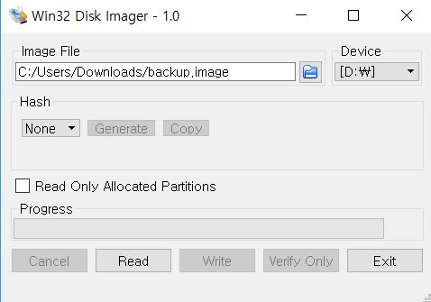

It would take about 20 minutes.

# RPi initial setting
connect micro SD card, HDMI cable, power in RPI.
if you turn on the RPi, it will be set for Korean. So you should change time, keyboard and Locale.
## Locale
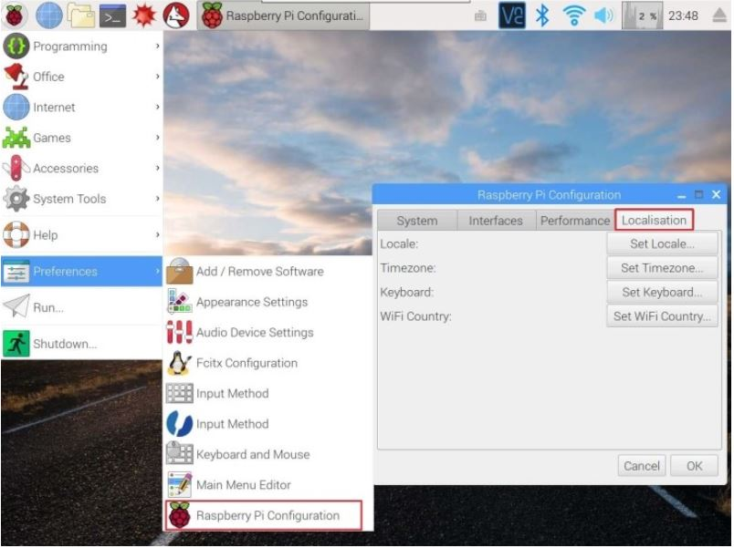
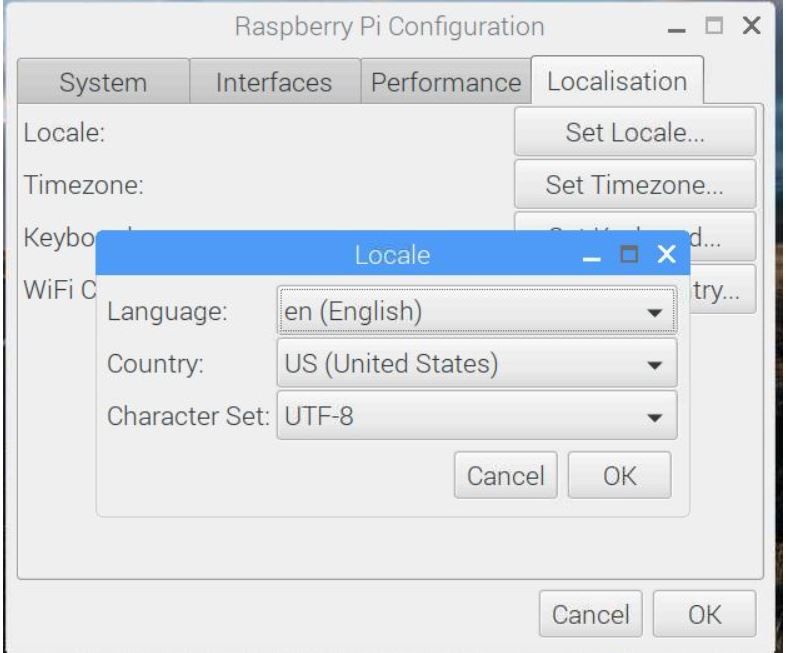

## Timezone
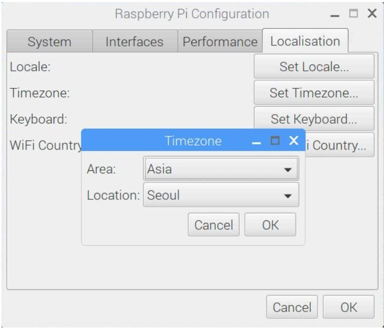

## Keyboard
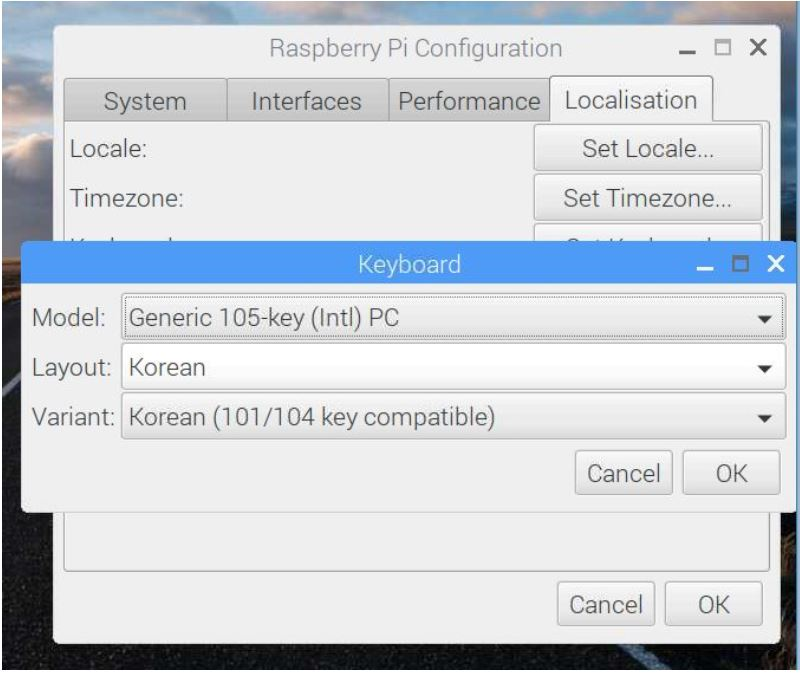

## set wifi
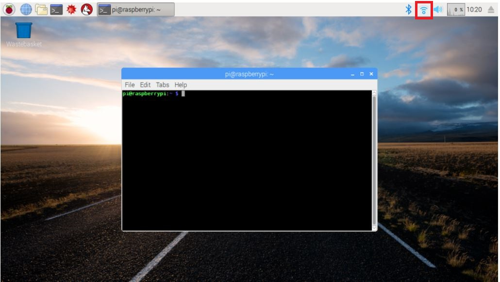

## setting nginx
open the 'sqltest' folder and move to mysite/mysite.

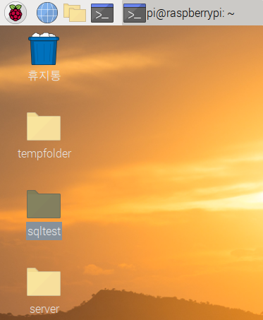

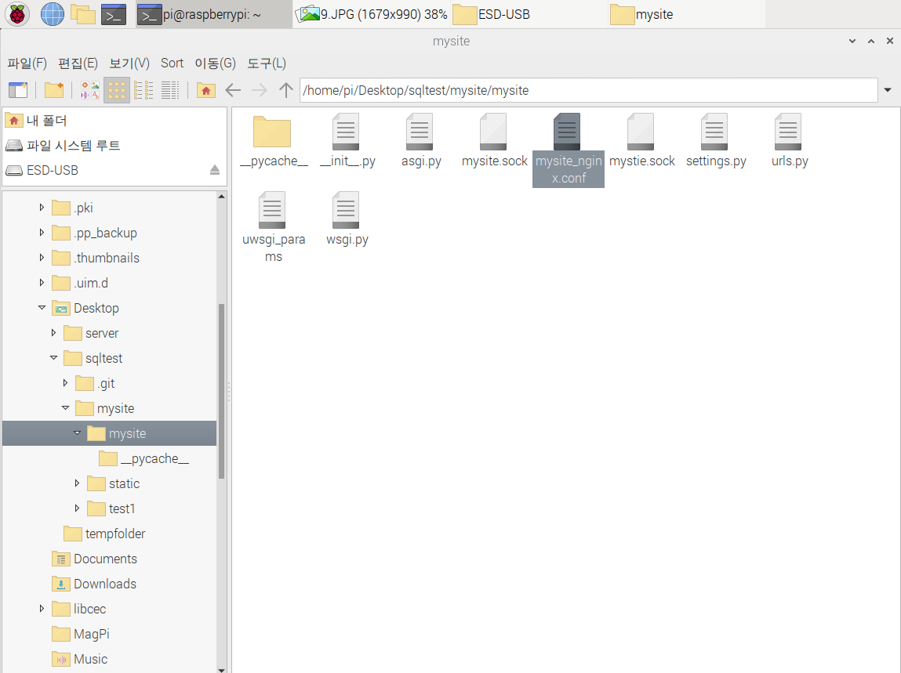

open mysite_nginx.conf file and change server_name to RPi's ip address

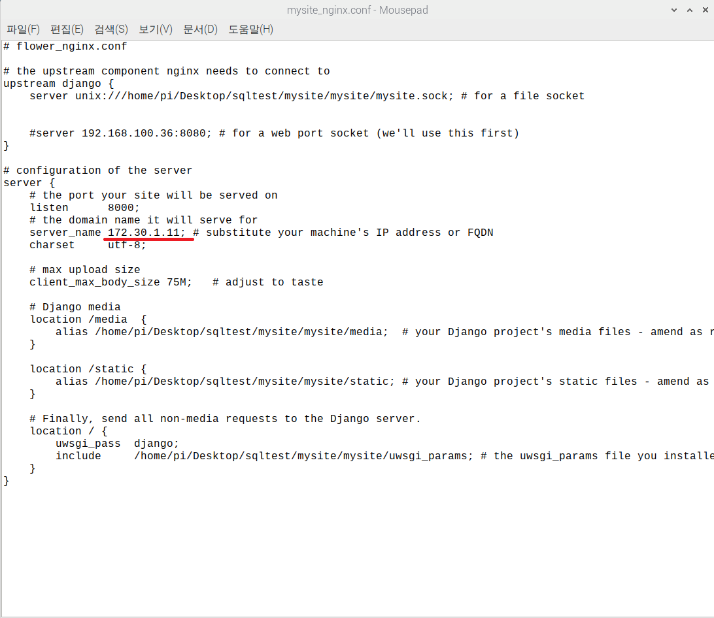

Follow this way to know RPi's ip address
1. open Terminal

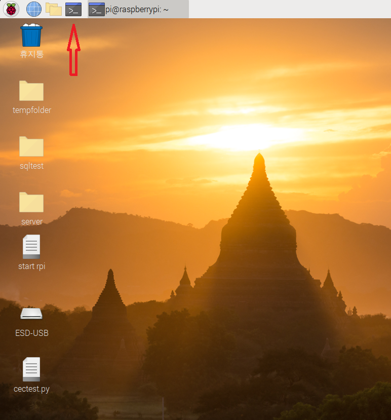

2. write 'hostname -I'

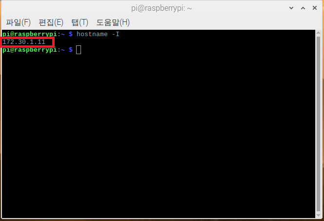

the red box is your ip address

# start program 
Open terminal and write this lines

	sudo /etc/init.d/nginx start
	cd /home/pi/Desktop/sqltest/mysite 
	uwsgi --socket /home/pi/Desktop/sqltest/mysite/mysite/mysite.sock --module mysite.wsgi --chmod-socket=666

Then Don't close the terminal and open new terminal.

	cd /home/pi/Desktop/server
	python server.py
추후 방법이 바뀔 예정

# open the web page
open the browser like chrome, opera, etc...
write RPi's address:8000 on the addressbar
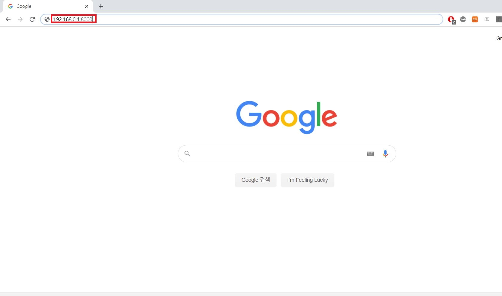
Then you can see two buttons on the web page and choose what you want to do.

# feature

## CECLogCapture
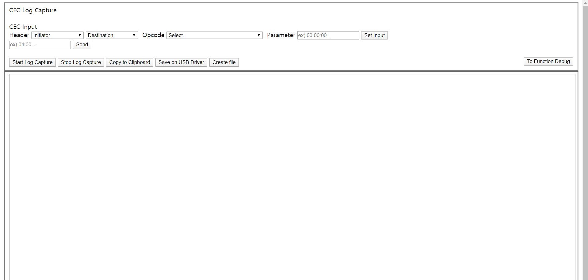
1. Header Initiator : you can choose everything of header contents but recommend RPi contents
2. Header Destination : choose device you want to send commend
3. Opcode : opcode that you want to send
4. Parameter : parameter of opcode
5. Set Input : (Header Initiator)(Header Destination):(opcode):(parameter)...
6. Send : send CEC Command to Destination that you set in 'Set Input'
7. Start Log Capture : start to capture CEC command that sent or received 
8. Stop Log Capture : stop to capture CEC
9. Copy to Clipboard : copy contents of textarea on the clipboard
10. Save on USB Driver : Stop capture CEC and save txt file that has contents of Webpage Textarea on the RPi's USB Stick (<32GB)
11. Create file : Stop capture CEC and make txt file that has contents of Webpage Textarea next to the button.
12. Clear : clear the logcapture contents (you can't restore the contents of CEC)
## FunctionDebug
추후 업데이트
# update
추후 업데이트
